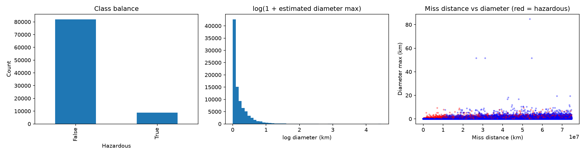
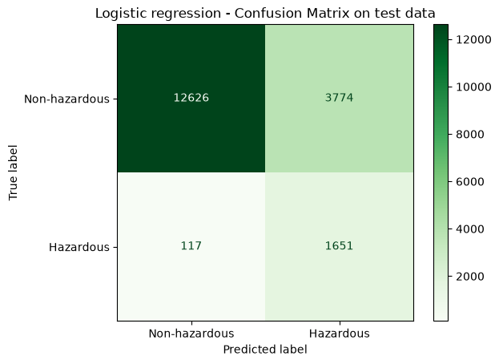

# Classifying Near-Earth Objects with Machine Learning

Predicting whether a near-earth object (NEO) is **potentially hazardous** to Earth, using logistic regression and gradient boosting on NASA close-approach data.

Course project for **CS-C3240 Machine Learning**.

📄 **[Read the full report (PDF)](report/NEO_hazard_classification_report.pdf)**

---

## Overview

Around 40,000 near-earth objects are currently known. Most pose no threat, but identifying the ones that might is important, and classifying them by hand doesn't scale. This project frames the task as a **supervised binary classification** problem: given an object's measured properties, predict whether NASA labels it as potentially hazardous.

Two models were compared:

| Model | Why it was chosen |
|---|---|
| **Logistic regression** | Simple, interpretable model designed for binary outputs. Trained with `class_weight="balanced"` to counter the class imbalance. |
| **Gradient boosting** | Ensemble of regression trees that can capture nonlinear relationships, since no single feature correlated strongly with the label. |

**Final model: logistic regression.** It detects **93% of hazardous objects** on unseen test data. For a safety problem, a false alarm is cheaper than a missed hazard, so recall was prioritised over accuracy.

## Dataset

[NASA - Nearest Earth Objects](https://www.kaggle.com/datasets/sameepvani/nasa-nearest-earth-objects) on Kaggle, compiled by Sameep Vani from NASA's NEO Earth Close Approaches database. The project uses `neo_v2.csv` (90,836 rows, no missing values).

| Feature | Description | Used |
|---|---|---|
| `est_diameter_max` | Estimated maximum diameter (km) | ✅ |
| `relative_velocity` | Velocity relative to Earth (km/h) | ✅ |
| `miss_distance` | Closest distance to Earth during the observed approach (km) | ✅ |
| `absolute_magnitude` | Intrinsic brightness (higher = fainter, usually smaller) | ✅ |
| `hazardous` | **Target**: potentially hazardous or not | 🎯 |
| `est_diameter_min` | Estimated minimum diameter (km) | ❌ perfectly correlated with max (r = 1.0) |
| `id`, `name` | Identifiers | ❌ no predictive value |
| `orbiting_body`, `sentry_object` | Same value for every row | ❌ no information |

The classes are heavily imbalanced: **90.3%** non-hazardous vs **9.7%** hazardous. A model that always answers "not hazardous" would already be 90% accurate, so accuracy alone is misleading.



## Method

1. **Cleaning:** dropped constant and identifier columns and the redundant `est_diameter_min`, then converted the label to 0/1.
2. **Correlation analysis:** absolute magnitude had the strongest link to the label (r = −0.365), followed by relative velocity (r = 0.191) and diameter (r = 0.183).
3. **Split:** stratified 64 / 16 / 20 train / validation / test split (`random_state=42`), preserving the class ratio in every set.

   | Set | Non-hazardous | Hazardous |
   |---|---:|---:|
   | Training | 52,476 | 5,658 |
   | Validation | 13,120 | 1,414 |
   | Test | 16,400 | 1,768 |

4. **Models**
   - Logistic regression on standardised features, `class_weight="balanced"`
   - Gradient boosting with `n_estimators=200`, `learning_rate=0.2` and `max_depth=5` (chosen by tuning on the validation set)
5. **Model selection** on the validation set. The test set was used only once, for the final model.

## Results

### Validation set

| Metric | Logistic regression | Gradient boosting |
|---|---:|---:|
| Accuracy | 0.782 | **0.916** |
| Precision | 0.299 | **0.671** |
| Recall | **0.923** | 0.264 |
| F1-score | **0.452** | 0.379 |

Gradient boosting looks better on accuracy but misses roughly three out of four hazardous objects. Its training accuracy (0.940) was also clearly higher than its validation accuracy, which suggests some overfitting. Logistic regression catches almost all hazardous objects at the cost of many false alarms.

### Final model on the test set (logistic regression)

| Accuracy | Precision | Recall | F1-score |
|---:|---:|---:|---:|
| 0.786 | 0.304 | **0.934** | 0.459 |



The model found **1,651 of 1,768** hazardous objects. About 70% of its "hazardous" predictions were false positives. Training, validation and test scores are nearly identical, so the model generalises well and shows no sign of over- or underfitting.

### Takeaways

- **Accuracy alone is misleading** on imbalanced data. The model with the best accuracy was the worst at the actual task.
- **There is a clear precision/recall trade-off.** Pushing either model toward better balance quickly degraded the other metric.
- **Possible improvements:** other model families, and data with more features that separate hazardous objects better.

## Repository structure

```
ML_Project/
├── archive/
│   └── neo_v2.csv                  # Raw Kaggle dataset
├── notebooks/
│   ├── data_check.ipynb            # Full pipeline: cleaning → split → models → evaluation
│   ├── clean_data.csv              # Generated: cleaned dataset
│   ├── train_data.csv              # Generated: training split
│   ├── validation_data.csv         # Generated: validation split
│   ├── test_data.csv               # Generated: test split
│   ├── plot_overview.png           # Generated: class balance and diameter plot
│   ├── metrics_comparison.png      # Earlier experiment: model comparison
│   └── threshold_confusion_matrices.png  # Earlier experiment: threshold tuning
├── report/
│   ├── NEO_hazard_classification_report.pdf
│   └── latex/                      # LaTeX source of the report
└── requirements.txt
```

## How to run

Requires Python 3.14 (the version used for this project).

```bash
git clone https://github.com/Funckin/ML_Project.git
cd ML_Project

python -m venv .venv
# Windows
.venv\Scripts\activate
# macOS / Linux
source .venv/bin/activate

pip install -r requirements.txt
```

Then open `notebooks/data_check.ipynb` in Jupyter or VS Code and run all cells. **Run it from inside the `notebooks/` folder.** It loads the data from `../archive/neo_v2.csv` and writes all generated files next to itself.

Main libraries: pandas, NumPy, scikit-learn and matplotlib.

## Authors

- **Adrian Funck** ([@Funckin](https://github.com/Funckin))
- **Joakim**
